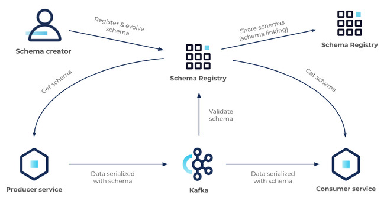

# kafka_commedy_club
Using Apache Kafka in combination with Cassandra, FastAPI and Flask/Dash to create a trading dashboard.


# Instructions (Windows)


## General
Install WSL2, docker-desktop.

```
Docker-compose up
```

Delete all existing docker images and data:
```
./scripts/clean_setup.ps1
```

Create virtual environment
```
python3.11 -m venv venv
```

Activate and install package localy, also installs requirements.

```
venv/Scripts/activate
pip install -e .
```


Run

```
python .main.py
```

Sometimes this gives issues, as the Cassandra Keyspace doesn't exist.
Then run:

```
./src/producers/example_producer.py
```

After that, try main again. Now open 127.0.0.1:8050 in your browser.

## Dev

```
pip install .[dev]
```

This command tells pip to install the current package (denoted by the .) along with the dependencies listed under the dev key in extras_require. If you are in a directory with a setup.py file, this will install the package itself in editable mode (-e), along with the extra dependencies specified for development.

# Docker-compose

The Docker Compose file orchestrates a development environment featuring Apache Kafka and Cassandra, along with essential components for schema management and data ingestion.

## Services Overview

- **ZooKeeper (`zk`)**: Manages Kafka cluster state. Runs on port 2181.

- **Kafka Brokers (`broker0`, `broker1`, `broker2`)**: Form the Kafka messaging backbone. Each broker is exposed on both internal and host-accessible ports (29092-29094 for internal, 9092-9094 for host).

- **Schema Registry (`schema-registry`)**: Manages Avro schemas for Kafka messages, facilitating message serialization and deserialization. Accessible on port 8081.

- **Kafka Connect (`kafka-connect`)**: Integrates Kafka with external data sources and sinks, such as Cassandra. Exposed on port 8083 for REST API interactions.

- **CLI Tools (`cli-tools`)**: Provides Kafka command-line tools within the Docker environment for administrative tasks.

- **Cassandra (`cassandra`)**: Stores large sets of data across multiple nodes without a single point of failure. Cassandra's service runs on port 9042.

- **Cassandra Shell (`cassandra-shell`)**: Offers a CLI environment for interacting directly with Cassandra.

## Noteworthy Configuration Details

- `KAFKA_LISTENER_SECURITY_PROTOCOL_MAP` and `KAFKA_ADVERTISED_LISTENERS` are configured to ensure communication between Kafka brokers and clients both within and outside the Docker network.

- `KAFKA_MIN_INSYNC_REPLICAS` and `KAFKA_DEFAULT_REPLICATION_FACTOR` are set to enhance data durability and fault tolerance.

- `SCHEMA_REGISTRY_KAFKASTORE_BOOTSTRAP_SERVERS` links the Schema Registry to the Kafka brokers, ensuring it can store and retrieve message schemas.

- Kafka Connect's `CONNECT_PLUGIN_PATH` includes paths to directories containing connectors and plugins, enhancing its capabilities to interface with various data systems.

## Networking

- All services are connected via a custom Docker network named `localnet`, facilitating seamless internal communication while isolating the setup from the host network.

# Sink Connector

This project uses the DataStax Sink Connector for Apache Cassandra.

https://www.confluent.io/hub/datastax/kafka-connect-cassandra-sink

To interact with the connect cluster, use the REST api:

```
http :8083/connector-plugins -b
```

The sink connector needs to be instructed to start using the a JASON-file. See the casssandra-sink-connector.json file as example below.

```json
{
  "name": "cassandra-sink-connector",
  "connector.class": "com.datastax.oss.kafka.sink.CassandraSinkConnector",
  "tasks.max": "1",
  "topics": "ttf_data.avro.python",
  "contactPoints": "cassandra",
  "port": 9042,
  "loadBalancing.localDc": "datacenter1",
  "keyspace": "realtime_data",
  "topic.ttf_data.avro.python.realtime_data.market_data.mapping": "timestamp=value.timestamp, ticker=value.ticker, open=value.open, high=value.high, low=value.low, close=value.close",
  "topic.ttf_data.avro.python.realtime_data.market_data.consistencyLevel": "LOCAL_QUORUM",
  "schema.registry.url": "http://localhost:8081",
  "key.converter": "org.apache.kafka.connect.storage.StringConverter",
  "key.converter.schemas.enable": "false",
  "value.converter": "io.confluent.connect.avro.AvroConverter",
  "value.converter.schema.registry.url": "http://schema-registry:8081"
}
```

To start the connector:
```
http PUT :8083/connectors/cassandra-sink-connector/config @./src/connectors/cassandra-sink-connector.json -b
```

To check the status:
```
http :8083/connector-plugins -b
```

Or to delete the workers:
```
http DELETE :8083/connectors/<name> -b
```

# Schema registry

The Confluent Schema Registry is a centralized repository for storing and managing schemas and metadata for Kafka producers and consumers. It ensures that all messages on Kafka topics adhere to a predefined schema, facilitating data compatibility and governance.



At its core, Schema Registry has two main parts:

- A REST service for validating, storing, and retrieving Avro, JSON Schema, and Protobuf schemas
- Serializers and deserializers that plug into Apache Kafka clients to handle schema storage and retrieval for Kafka messages across the three formats.

To list available subjects registered to Schema Registry
```
http :8081/subjects
```


To list versions of a specific subject
```
http :8081/subjects/<schema_name>/versions
```


To fetch the registered subject for a specific version
```
http :8081/subjects/<schema_name>/versions/2
```


To fetch a schema by its global unique id
```
http :8081/schemas/ids/2
```


To check the schema compatibility mode
```
http :8081/config
```


Validation against latest (not compatible)
```
http POST :8081/compatibility/subjects/<schema_name>/versions/latest \
    schema="<schema_string>"
```


Validation (compatible)
```
http POST :8081/compatibility/subjects/<schema_name>/versions/latest \
    schema="<schema_string>"
```

Register schema
```
http POST :8081/subjects/<schema_name>/versions \
    schema="<schema_string>"
```

### See the schema in action

First start the example_producer_avro.py:
```
python ./src/proucers/example_producer_avro.py
```

Now first try to read the produced messages without the use of the schema registry:
```
docker exec -it cli-tools kafka-console-consumer --bootstrap-server broker0:29092 --topic ttf_data.avro.python --from-beginning
```

The messages will look like:

☺&2024-02-09 10:41:32▬%TFM 1!-ICN���(\�]@=
ףp]^@H�z¶�g\@q=
ףp\@
☺&2024-02-09 10:41:32▬%TFM 1!-ICN{¶�G�ZY@q=
ף[@�p=
��V@R�▲���Y@

Start a Kafka Avro console consumer using Docker to consume messages from a specific Kafka topic and deserialize them using Avro schemas managed by the Confluent Schema Registry.
```
docker exec -it schema-registry kafka-avro-console-consumer --bootstrap-server broker0:29092 --topic ttf_data.avro.python --property "schema.registry.url=http://localhost:8081" --from-beginning

```

The message will now be displayed correctly.

# Todo

- Use Confluent Schema Registry with Apache Avro
    - Adjust library of kafka python into confluent verion
    - Create schema
    - Create Afro ...
    - Integrate in producer
    - Integrate in consumer
- Setup Sink Connector Cassandra
    - ...
- Update README
    - Describe containers
    - Describe cli-tools
    - Reason Kafka
    - Reason Cassandra
    - ML Engineering
- Tests
    - ...
